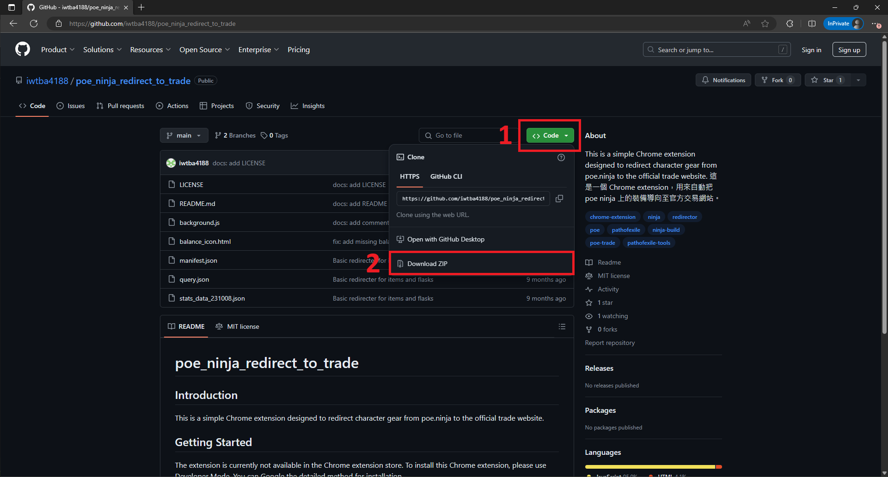
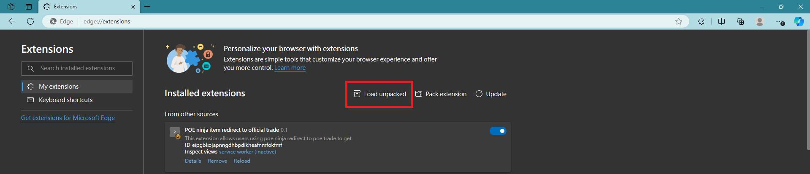
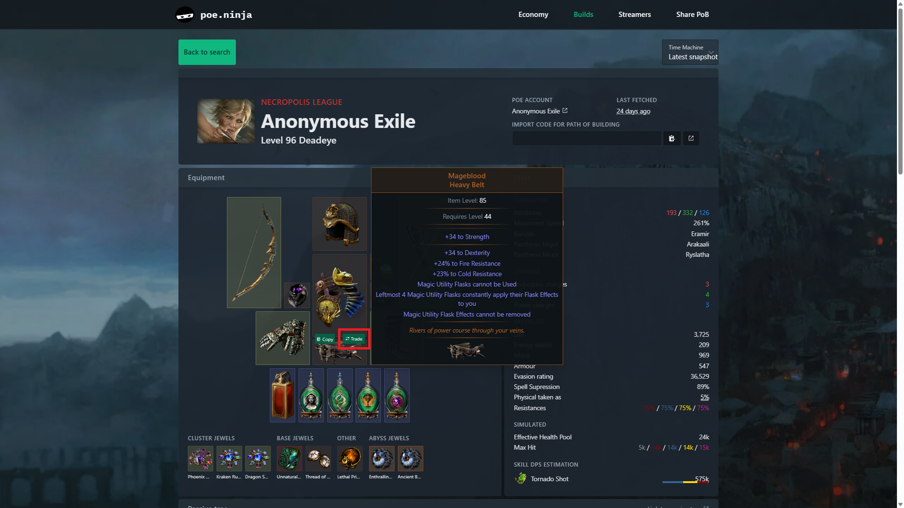
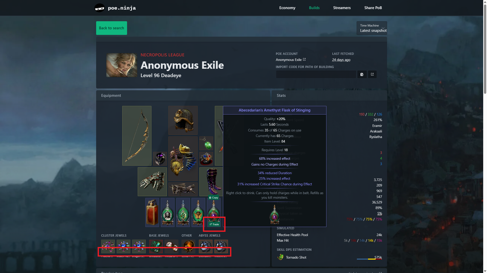
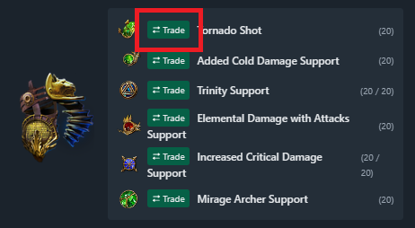
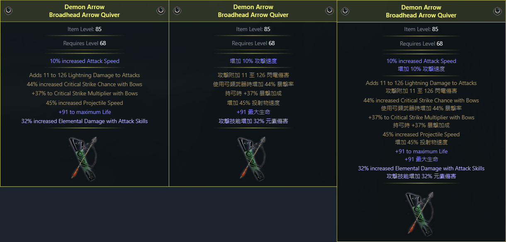
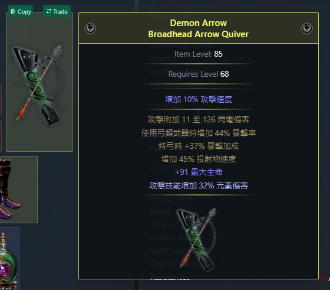

# PoE Ninja Redirect to Trade

English | [繁體中文](./docs/README-zh-TW.md) 

<https://github.com/user-attachments/assets/26498680-cfa1-4897-997e-38ccb25e45ce>

## Introduction
A Chrome extension that links the [poe.ninja](https://poe.ninja/builds) build page to the official trading site for all equipment (including flasks, jewels, and gems), and including a built-in feature for Chinese, Korean, and Russian localization of modifiers.

**Note:** Please note that the extension does not support the PoE 2 Ninja page yet.

## Features
- Redirected equipment, flasks, jewels, and gems to the official trade market with a single click.
- Applying filters for modifiers (and for gems, filtering by quality and gem level) while searching.
- Equipment, flasks, and jewels modifiers localized in Chinese, Korean, and Russian.

## Getting Started
**PoE Ninja Redirect to Trade** is currently available on the Chrome Web Store. You can also install it manually.

### Installation
1. Download the ZIP file from the [Github page](https://github.com/iwtba4188/poe_ninja_redirect_to_trade) or [Latest Release](https://github.com/iwtba4188/poe_ninja_redirect_to_trade/releases). Extract the file.

2. Take Edge for example, select "Load unpacked."

3. Select the extracted file and click OK.
4. Go to any character's equipment page. You can now navigate to the trading marketplace with one click.

### Usage

<!-- TODO: update v1.2.0 contents -->

1. Navigate to any character page, hover the mouse over the equipment, and if 'Trade' appears, it indicates that the system is functioning properly. You can click to proceed to the trading marketplace.

2. The method for using flasks and jewels is the same. **Note: The jewel button is located below the jewel image (as shown), and it will not display a green button, but you can still click to proceed.**

3. Gems are displayed to the left of the gem name. 

4. To change the display language of modifiers and other settings, click on the extension icon, then click the dropdown for each setting to change it.

5. If some word drop-downs do not take effect immediately, please refresh the page (F5 or Ctrl+R).

## TODO
- [x] There are still errors in modifier matching or matches that are not successful.
- [x] The sequence of flasks and jewels is incorrect.
- [ ] Translate the remaining texts into Chinese.
- [x] Add more custom Filter rules.

## Acknowledges
- The modifier matching utilizes the matching table (English, Chinese, Korean and Russian) in [Awakened PoE Trade](https://github.com/SnosMe/awakened-poe-trade) by [@SnosMe](https://github.com/SnosMe).
- To avoid numerous grammatical errors in my poor English, this README was translated using Copilot and manually corrected for inaccuracies.

## Support Me
