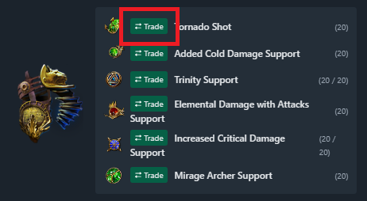

# poe ninja redirect to trade (and Chinese localization of modifiers)

English | [繁體中文](./docs/README-zh-TW.md) 

## Introduction
This is a simple Chrome extension designed to automatically generate buttons that link to the official trading site for all equipment (including flasks, jewels, and gems) of each character listed on [poe ninja](https://poe.ninja/builds), and it includes a built-in feature for Chinese localization of modifiers (which can be disabled)..

## Features
- Equipments, flasks, jewels, and gems can be quickly redirected to the official trade market with a single click, while applying filters for modifiers (and for gems, filtering by quality and gem level).
- Equipments, flasks, and jewels modifiers localized in Chinese.

## Getting Started
This Chrome extension is not currently available on the Chrome Web Store. If you need to install it, please search for the relevant methods or follow the installation instructions provided below.

### Installation
1. To download the current script content as a ZIP file from the [Github page](https://github.com/iwtba4188/poe_ninja_redirect_to_trade), follow these steps.

2. For instance, in the Edge browser, select "Load unpacked."

3. Locate the ZIP file you just downloaded (need to extract), select it, and click OK.
4. Then, go to any character's equipment page, and you can quickly navigate to the trading marketplace with one click.

### Usage
1. Navigate to any character page, hover the mouse over the equipment, and if 'Trade' appears, it indicates that the system is functioning properly, and you can click to proceed to the trading marketplace.

2. The method for using flasks and jewels is the same. **Note: The jewel button is located below the jewel image (as shown), and it will not display a green button, but you can still click to proceed.**

3. Gems are displayed to the left of the gem name. 

4. Click on the extension icon (currently the gray P), then click "詞墜中文化目前為 關閉" to change it to "詞墜中文化目前為 開啟"

5. If some word drop-downs do not take effect immediately, please refresh the page (F5 or Ctrl+R).

## TODO
- [x] (Fixed) There are still errors in modifier matching or matches that are not successful.
- [x] (Fixed) The sequence of flasks and jewels is incorrect.
- [ ] Translate the remaining texts into Chinese.
- [ ] Add more custom Filter rules.

## Acknowledges
- The modifier matching utilizes the matching table (Chinese & English) in [Awakened PoE Trade](https://github.com/SnosMe/awakened-poe-trade) by [@SnosMe](https://github.com/SnosMe).
- To avoid numerous grammatical errors in my poor English, this README was translated using Copilot and manually corrected for inaccuracies.