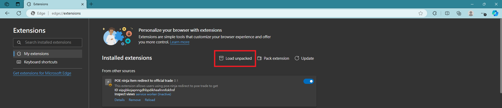
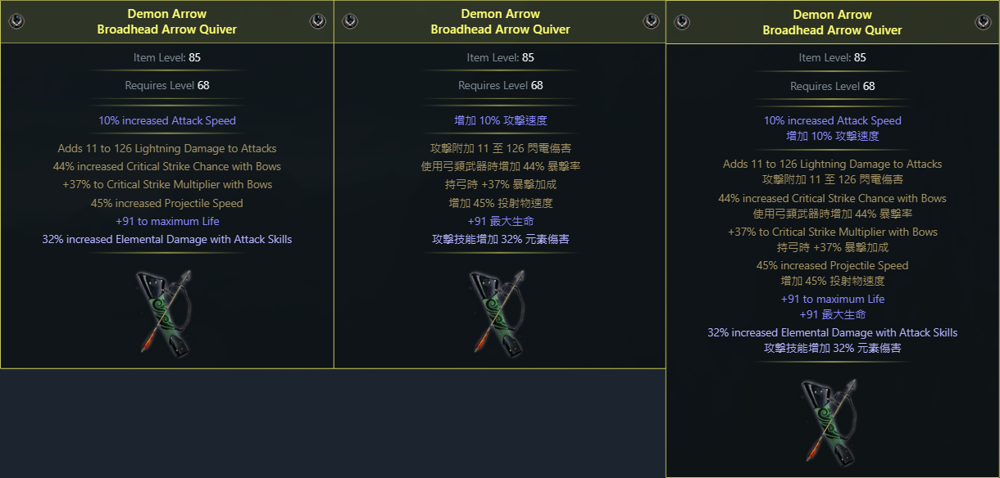
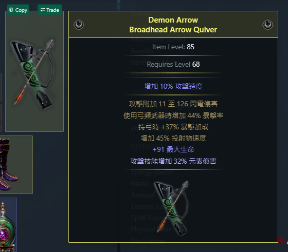

# 忍者網裝備重新導向交易市集（附加詞綴中文化）

[English](../README.md) | 繁體中文 

## Introduction
這是一個簡易的 Chrome 擴充功能（Chrome extension），用來自動生成 [poe ninja](https://poe.ninja/builds) 中各角色所有裝備（含藥劑、珠寶及寶石）導向至官方交易網站的按鈕，並內建提供詞綴中文化功能（可關閉）。

## Features
- 裝備、藥劑、珠寶及寶石一鍵導向官方交易市集，同時套用詞綴篩選（寶石則為品質與寶石等級）。
- 裝備、藥劑及珠寶的詞綴中文化。

## Getting Started
目前這個 Chrome 擴充功能已經上架至 Chrome 線上應用程式商店。如需手動安裝，請自行搜尋相關方法，或按照下文介紹安裝。

### Installation
1. 從 [Github 網頁](https://github.com/iwtba4188/poe_ninja_redirect_to_trade) 下載當前腳本內容的 ZIP 檔。

2. 以 Edge 瀏覽器為例，選擇「Load unpacked」。

3. 找到剛剛下載的 ZIP 檔（需解壓縮），選擇並按確定。
4. 接著，到任一角色的裝備頁面，即可一鍵前往交易市集。

### Usage
1. 前往任意角色頁面，將滑鼠移至裝備上方，如果出現「Trade」代表運作正常，可以點擊前往交易市集。

2. 藥劑及珠寶使用方法相同。**注意：珠寶按鈕在珠寶圖片下方（如圖），並不會顯示綠色按鈕，但仍然可以點擊前往。**

3. 寶石則顯示在寶石名稱左方。 

4. 按下擴充功能的圖示（目前是白底黑色 T），點擊「詞綴顯示 「英文」」，使其轉變為「詞綴顯示 「中文」」，再按一次變為「詞綴顯示 「英文 & 中文」」。

5. 如果部分詞綴沒有立即生效的話，請重新整理頁面（F5 或 Ctrl+R）。

## TODO
- [x] （已修復）目前仍有些許詞綴配對錯誤或無法配對成功。
- [x] （已修復）藥劑與珠寶的順序錯誤。
- [ ] 其餘非詞綴部分中文化。
- [ ] 更多自定義 Filter 規則。

## Acknowledges
- 詞綴查找使用 [Awakened PoE Trade](https://github.com/SnosMe/awakened-poe-trade) by [@SnosMe](https://github.com/SnosMe) 中的詞綴比對表（中英文）。
- 英文版本使用 Copilot 協助翻譯。